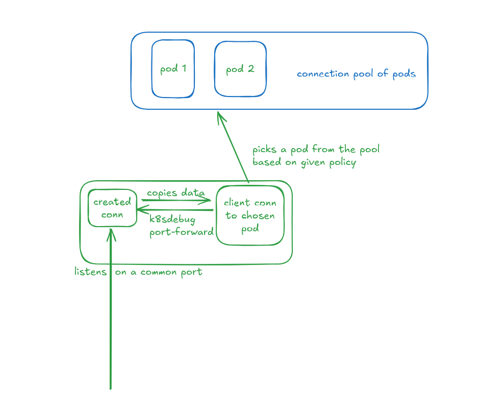

# K8sdebug

## Scope

This tool is created to solve my personal pain points while debugging an application inside K8s environment. This tool is not written from the perspective of a devops engineer but rather from the perspective of a backend application engineer trying to debug issues with the application in k8s environment. This tool is not created to be used directly with production environments. It expects certain privileges that might not be available in production. The audience for this is specifically developers running dev clusters or local clusters while debugging an application related issue. Any future feature that may be added will respect the above fact and not go beyond that scope. There might be mature tools available already that might have some intersection with the features provided here but most of those tools are devops centric. This tool is primarily application centric.

**⚠️ Production Warning**  
This tool requires elevated privileges and is intended for development clusters only. Never use in production environments.

## 🚀 Features

### 🔍 Persistent Log Analysis

**Problem Addressed:**
Kubernetes does **not** store logs of deleted pods by default. Tools like `kubectl logs` only work for existing pods. Existing solutions (e.g., Loki, Elasticsearch) require complex log aggregation setups.

**Solution:**

k8sdebug runs a daemon to persistently capture logs for all pods in a namespace to a local directory, with features like diffing logs across pods in a deployment.

**Usage**

```bash
# Start recording logs in a namespace
k8sdebug logs record start -n my-namespace

# Compare logs across deployment pods
k8sdebug logs diff -n my-ns --type deployment --tail 20 my-app

# Manage log storage
k8sdebug logs setpath ~/debug-logs  # Change storage location
k8sdebug logs cleanup --hard        # Remove all logs
```

``` bash
#To get the diff between all the pods created under this deployment on the last 20 lines of the logs along with timestamp of each pod.
k8sdebug logs diff -n <namespace> --type deployment --tail 20(default) <name of deployment>
```

```bash
#If there were 5 pods then 4 diffs will be generated one after the other like this.
pod1 (timestamp)-pod2 (timestamp)
<diff>
pod2(ts) - pod3(ts)
<diff>
.... and so on.
```

```bash
k8sdebug logs show -n <namespace> --type replicaset --tail 20(default) --index 3
(the no of pod chronologically which was created. default to latest)  <name of replicaset>
# will log the logs of 3rd pod created under this replicaset.
```

### What is --type?

Here type is actually the first object in the chain of ownerReferences that led to the creation of the pod. This is the smart part where k8sdebug finds all pods under that root parent. The rational for this UX is that application developers trying to debug usually don't care about the objects created in the Middle. For instance, if a user deployed an Argo Application which resulted in creation of pod then their rational would be that "I know the name of my Argo App, now help me analyze logs on the pods created under it"

```bash
k8sdebug logs record stop -n <namespace>
#will stop the daemon process.
```

```bash
k8sdebug logs setpath <path>
#can set the default path where files are stored. Defaults to /tmp.
```

```bash
k8sdebug logs getpath
#returns the path. The path is stored in a .k8sdebug file in ~ in key value form like
```

### 🔄 Smart Port Forwarding



```bash
k8sdebug port-forward \
  -n my-namespace \
  --labels "app=backend" \
  --policy round-robin \
  --hostport 8080 \
  --containerport 80
# Supported policies:
# - round-robin (default)
```

🤝 Contributing
I welcome contributions that align with our scope:

Open an issue to discuss proposed changes

Maintain comprehensive test coverage

Document new features clearly

## 📅 Development Roadmap

| Feature                | Status     | Version Target |
|------------------------|------------|----------------|
| Log Aggregation          | ✅ Stable  | v0.1.0         |
| Port Forward Policies  | ✅ Stable  | v0.1.0         |
| Local Dev Simulatio(Kubebox)   | Planned    | v0.3.0         |
| Connectivity Testing   | Planned | v0.4.0         |
| Traffic Visualization  | Planned    | v0.5.0         |

## License

This project is licensed under the MIT License. See [LICENSE](LICENSE) for details.
